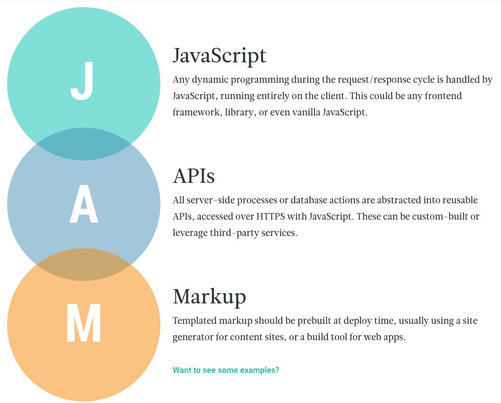

在寫這個網站時，一直在想應該用什麼工具去開發。由於個人比起HTML + CSS，比較喜歡用react去開發frontend，所以在一番Gooogle 後，找到了[GatsbyJS](https://www.gatsbyjs.org/)。在GatsbyJS的網站，找到了一個buzzword - **JAMstack**

> JAMstack: noun \’jam-stak’\ 
> Modern web development architecture based on client-side JavaScript, reusable APIs, and prebuilt Markup.

[了解更多](https://jamstack.org)

*這個bussword是由CDN公司Netlify創造的，原因不用多想，就是在推介CDN。*
話雖如此，但是將整個Static網站放上CDN，沒有server render的確是會比較快。想深一層，其實Blockchain上的DApps很像JAMstack，只不過是在不同的network。
