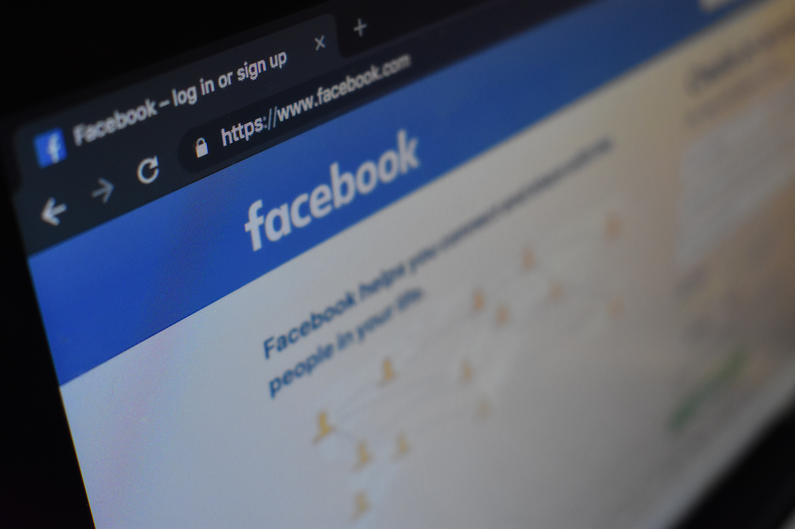

近日網上有很多流言，其中有一個是關於用戶不能分享朋友的post，懷疑只要有敏感字就不能分享。
基於研究（八掛）精神，Google了一下，發現這只是Facebook的私隱政策，跟敏感字無關。
根據[ricksdailytips.com](https://www.ricksdailytips.com/missing-share-button-facebook-posts/)和[Facebook community](https://www.facebook.com/help/community/question/?id=10154922198073551)二文, 我們得出：

> Facebook recently removed the “Share” button from all posts that don’t have their privacy levels set to “Public”. Their reasoning is if you have a post set to “Friends” there’s no reason for your friends to share it since your friends will see it anyway – and no one else will be allowed allowed to see it anyway.

> Making you posts PUBLIC affects sharing and downloading, but not who can access your page...

其實都是可以理解，只是有點麻煩，我設定只有我的朋友能看到，沒有理由所有朋友的朋友都能看到。只要大家把想被分享的post設定為公開就可以給朋友分享，而你的私隱設定得好，朋友以外是不能主動看到你的post的。

###測試設定成朋友
- 單純文字，沒有share button
- 有連結，可以分享，但是分享不了朋友的文字
- 純文字，tag 了朋友a，朋友a能分享，朋友b沒有share button

###測試設定成公開
- 朋友都可以分享
- 有連結的話沒有登入facebook的人都可以看到
- 所以說看到就能分享

###FYI
[怎樣設定誰可以看見相關內容](https://www.facebook.com/help/120939471321735?helpref=faq_content)
