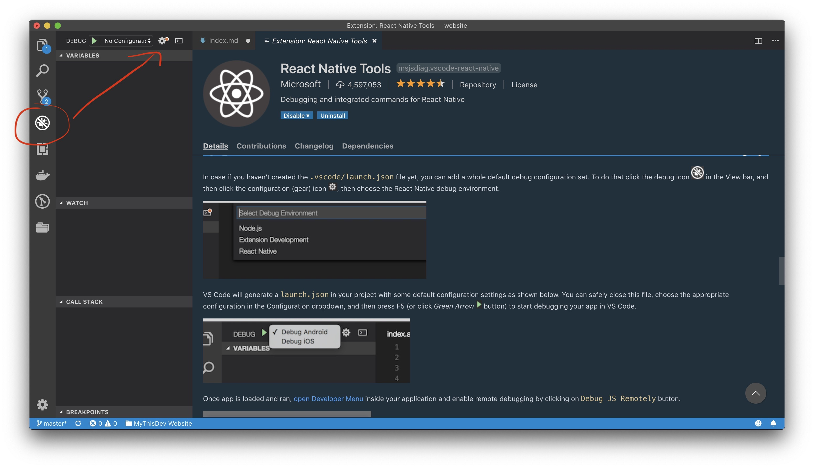
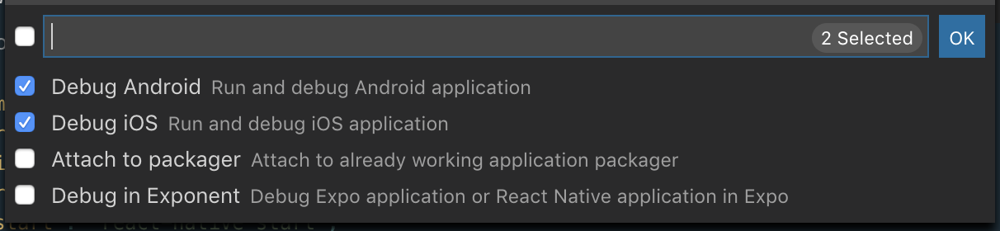

在這裡分享一下我的react native project setup, 也是為了給自己留個記錄。

###安裝React native 和init project
* 首先我們先跟[官網的guideline](https://facebook.github.io/react-native/docs/getting-started)安裝一下。我個人是喜歡用React Native CLI去init一個project, 因為我覺得Expo的sdk有點跟不上。

###VSCode setup
* 安裝extension: React Native Tools
* Debug setting
    * 先搞好Config, 在下圖新增config, 選擇"React Native"
    * 
    * 
    * 然後會generate了`.vscode/.launch.json`, 搞定 
    * [FYR](https://github.com/microsoft/vscode-react-native)
* project setting
    * 新增`.vscode/.settings.json`, 輸入:
    ```javascript
    {
        "files.associations": {
            "*.js": "javascriptreact"
        }
    }
    ```
    * 它會把你的js自動當成jsx

###防止relative import hell (../../../package)
應該有很多方法，但是我喜歡使用`babel-plugin-root-import`這個package。
* 安裝： `yarn add babel-plugin-root-import --dev`
* 修改你的`babel.config.js`
    ```javascript
    module.exports = {
        presets: ['module:metro-react-native-babel-preset'],
        plugins: [
            ["babel-plugin-root-import", {
                "rootPathPrefix": "~"
            }]
        ]
    };
    ```
    * 之後你就可以灰import 時用`~`去代表project root path
    * 為了防止vscode 混亂，我們新增`jsconfig.json`
    ```javascript
    {
        "compilerOptions": {
            "baseUrl": ".",
            "paths": {
                "~/*": ["./*"]
            }
        }
    }
    ```
    * [FYR](https://www.npmjs.com/package/babel-plugin-root-import)

###Eslint 與 Prettier settings
這兩個一起用真的是滿江紅....
* 先安裝一些packages `yarn add prettier eslint-plugin-prettier eslint-config-prettier eslint-config-airbnb-base babel-eslint --dev `
* 修改`.eslintrc.json`成
    ```javascript
    module.exports = {
    root: true,
    parserOptions: {
        parser: 'babel-eslint',
        ecmaVersion: 9,
        sourceType: 'module',
    },
    extends: [
        '@react-native-community',
        'airbnb-base',
        'eslint:recommended',
        'plugin:prettier/recommended'
    ],
    plugins: ['prettier'],
    };
    ```
* 修改`.vscode/settings.json`成
    ```javascript
    {
        "files.associations": {
            "*.js": "javascriptreact"
        },
        "prettier.eslintIntegration": true,
        "eslint.autoFixOnSave": true,
        "editor.formatOnSave": true,
        "eslint.validate": ["javascript", "javascriptreact"],
        "eslint.options": {
            "configFile": "./`.eslintrc`.js"
        },
    }
    ```
* 之後眼睛便會舒服很多


