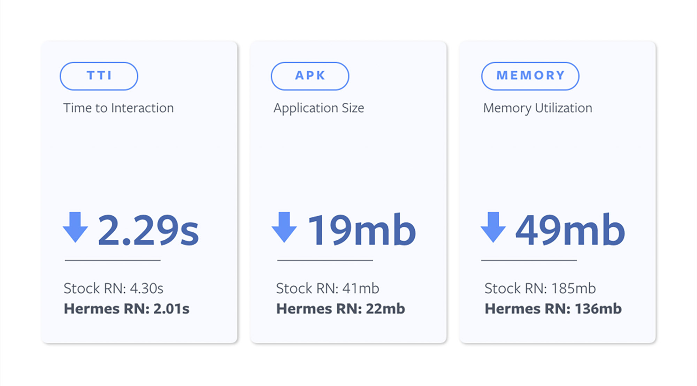

最近Facebook 推出了一個新的js engine給Android - [Hermes](https://github.com/facebook/hermes)

根據上圖，Hermes把`Parse`和`Compile`的工作搬到build，而不是在runtime做，從而提昇 time to interact (TTI)。

###TLDR; [了解更多](https://code.fb.com/android/hermes/)
使用Hermes的好處就是:

> 就是快了
> 小了
> 用少了memory

由於這個工具是opt-in的，所以大家要對`android/app/build.gradle`做少少改動
```java
  project.ext.react = [
      entryFile: "index.js",
-     enableHermes: false  // clean and rebuild if changing
+     enableHermes: true  // clean and rebuild if changing
  ]
```

如果是已經build過的project, 要clean 一下:
```shell
cd android && ./gradlew clean
```

###FYR
[更多設定](https://facebook.github.io/react-native/docs/hermes)
